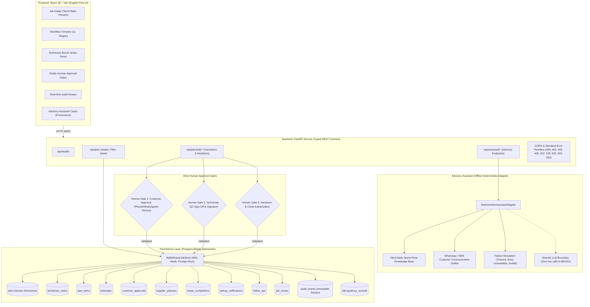

# Benchbook Architecture Specification

## 1. Executive Summary & Core Mission

**One sentence**: *Benchbook keeps a repair shop moving from intake to pickup without making the technician become a full-time coordinator.*

In a high-throughput independent repair shop (such as in Gandhipuram, Coimbatore or Ritchie Street, Chennai), a technician's most scarce and valuable resource is focused bench time diagnosing circuits, soldering SMD components, and conducting quality control tests. Technicians lose hours every day serving as manual coordinators: answering customer calls for status updates, tracking down spare parts across local supplier markets, drafting quotes, obtaining customer authorizations, and recording payments.

Benchbook automates and streamlines coordination while enforcing a strict constitutional boundary:
**The technician owns diagnosis, repair method, and final quality decision. The agent may extract, summarize, suggest parts/status, and draft messages, but it must NEVER approve work, spend money, mark a repair complete, or alter a final quality decision without an explicit human action.**

---

## 2. Architecture Diagram

---

## 3. Workflow State Machine & Lifecycle Graph

Benchbook implements a true persisted 11-stage vertical slice:

`intake -> diagnosis -> parts_lookup -> estimate_pending -> customer_approved -> supplier_ordered/parts_ready -> repair_queue -> repair_in_progress -> repair_completed -> ready_for_pickup -> follow_up -> closed`

| Source State | Target State | Action Name | Authorized Actor Types | Human Gate? |
|---|---|---|---|:---:|
| `none` | `intake` | `create_job` | `technician`, `system` | No |
| `intake` | `diagnosis` | `add_diagnosis` | `technician` | No |
| `diagnosis` | `parts_lookup` | `lookup_parts` | `technician`, `assistant` | No |
| `diagnosis` | `estimate_pending` | `create_estimate` | `technician` | No |
| `parts_lookup` | `estimate_pending` | `create_estimate` | `technician` | No |
| `estimate_pending` | `customer_approved` | `approve_estimate` | `technician`, `customer` | **YES** |
| `estimate_pending` | `estimate_rejected` | `reject_estimate` | `technician`, `customer` | **YES** |
| `customer_approved` | `supplier_ordered` | `update_supplier_status` | `technician` | No |
| `customer_approved` | `parts_ready` | `update_supplier_status` | `technician` | No |
| `customer_approved` | `repair_queue` | `queue_repair` | `technician` | No |
| `supplier_ordered` | `parts_ready` | `update_supplier_status` | `technician` | No |
| `parts_ready` | `repair_queue` | `queue_repair` | `technician` | No |
| `repair_queue` | `repair_in_progress` | `start_repair` | `technician` | No |
| `repair_in_progress`| `repair_completed` | `complete_repair` | `technician` | **YES** |
| `repair_completed` | `ready_for_pickup` | `send_pickup_notification`| `technician` | No |
| `ready_for_pickup` | `follow_up` | `customer_pickup` | `technician` | No |
| `follow_up` | `closed` | `close_job` | `technician` | **YES** |
| `estimate_rejected` | `closed` | `close_job` | `technician` | **YES** |

---

## 4. Human Approval Gates (Non-Negotiable Invariants)

1. **Gate 1: Estimate Authorization (`approve_estimate` / `reject_estimate`)**:
   - Only human customers (or technicians recording customer communication) can authorize repairs or authorize spending.
   - Assistant actor calls return `403 Forbidden` (`HUMAN_APPROVAL_REQUIRED`).
2. **Gate 2: Quality Control & Repair Completion (`complete_repair`)**:
   - Only human technicians who performed bench testing and burn-in can certify QC.
   - Requires explicit `technician_signature_confirmed = True` and passed QC checklist.
   - Assistant actor calls return `403 Forbidden` (`HUMAN_APPROVAL_REQUIRED`).
3. **Gate 3: Job Closure (`close_job`)**:
   - Requires human sign-off confirming payment, handover, and warranty activation.
   - Assistant actor calls return `403 Forbidden` (`HUMAN_APPROVAL_REQUIRED`).

---

## 5. Optimistic Concurrency & Idempotency Controls

- **Optimistic Locking**: Every mutation endpoint requires `expected_version: int`. If the database version has progressed, the server refuses the write and returns `409 Conflict` (`STATE_CONFLICT`) along with the latest job snapshot.
- **Idempotency Keys**: Requests accept an optional `Idempotency-Key` HTTP header or body parameter. Once a request completes successfully, its response payload is stored in `idempotency_records`. Replayed requests return the cached response immediately with no duplicate records, no duplicate audit entries, and no version bump.
- **Immutable Audit Trail**: Every state change records an entry in `audit_events` capturing `from_state`, `to_state`, `actor_type`, `actor_name`, `version_before`, `version_after`, payload summary, and ISO timestamp.

---

## 6. Assistant Adapter & Strands Integration Boundary

- **Offline Deterministic Adapter (`DeterministicAssistantAdapter`)**:
  - Encapsulates domain knowledge for high-frequency Tamil Nadu repair items (BLDC Fans, Split AC Inverter PCBs, Mixer Grinders, Microwave Ovens, Laptops, Smartphones).
  - Generates culturally authentic, professional WhatsApp and SMS notification drafts.
  - Returns explicit provenance metadata (`engine`, `model`, `generated_at`, `advisory_only: true`, `requires_human_verification: true`).
- **Honest Failure Simulation Modes**:
  - `mode="timeout"` -> `504 Gateway Timeout` (`ASSISTANT_TIMEOUT`)
  - `mode="busy"` -> `429 Too Many Requests` (`ASSISTANT_BUSY`)
  - `mode="unavailable"` -> `503 Service Unavailable` (`ASSISTANT_UNAVAILABLE`)
  - `mode="invalid_output"` -> `502 Bad Gateway` (`ASSISTANT_INVALID_OUTPUT`)
- **Bounded Strands Seam**:
  - The adapter implements a standalone protocol ready for LLM integration without changes to domain logic or HTTP routers.
  - Zero live network calls and zero spend (₹0.00) in BB-001.

---

## 7. Persistence & Postgres Readiness

The storage layer (`SqliteRepairJobStore`) is decoupled from the domain:
- SQLite runs with `PRAGMA foreign_keys = ON;` and `PRAGMA journal_mode = WAL;`.
- Tables use standard SQL column types, parameterized queries, and JSON columns stored as text.
- Ready for a drop-in Postgres adapter (`PostgresRepairJobStore`) without modifying the domain models or HTTP routes.
